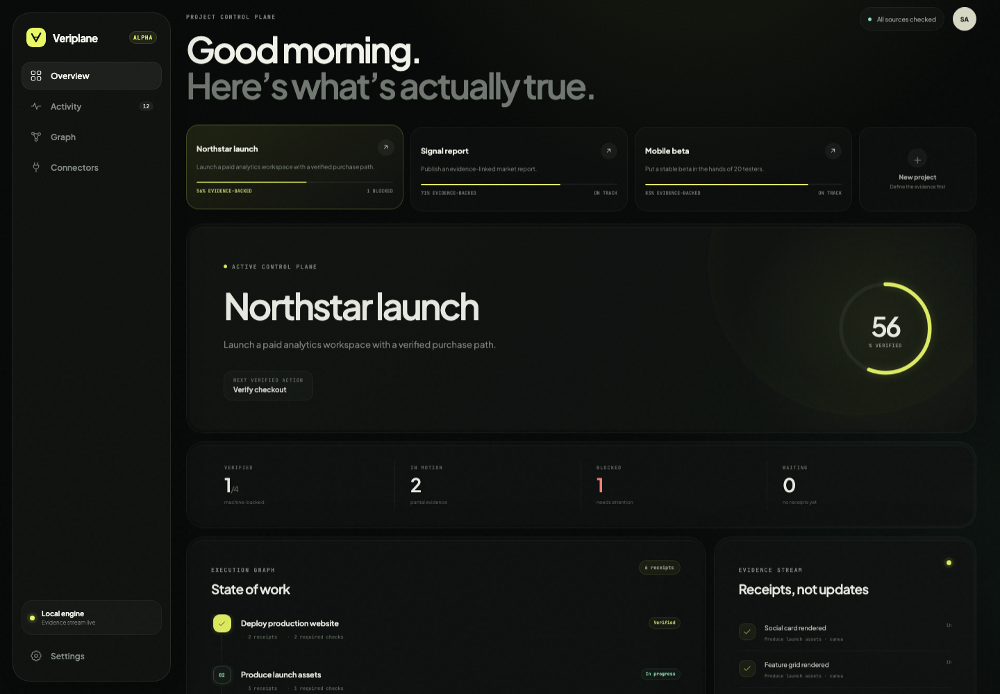
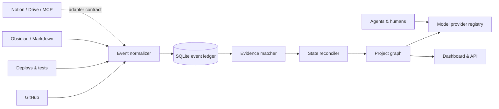

<div align="center">
  
  <h1>Veriplane</h1>
  <p><strong>Project truth, backed by evidence.</strong></p>
  <p>An open-source control plane that reconstructs project state from GitHub, deployments, tests, agents, files, and human approvals—across any model.</p>

[](https://github.com/WealthRxAi/veriplane/actions/workflows/ci.yml)
[](LICENSE)
[](docs/architecture.md)
[](ROADMAP.md)
</div>



## This is not another AI second brain

Chat history tells you what an agent _said_. Veriplane tells you what the systems of record can _prove_.

```text
GitHub commit ─┐
CI passed ─────┼─> event ledger ─> evidence policy ─> verified task state
Deploy healthy ┘                                      └─> project progress
```

A model may recommend the next action. It cannot promote its own work to `verified`. A task changes state only when its declared checks have matching, current evidence.

| Typical AI workspace          | Veriplane                                          |
| ----------------------------- | -------------------------------------------------- |
| Remembers conversations       | Reconstructs work state                            |
| Model reports “done”          | Systems provide receipts                           |
| One model owns context        | Models are interchangeable workers                 |
| Progress is estimated         | Progress is policy-derived                         |
| Notes are the source of truth | An append-only event ledger is the source of truth |

## Run the demo in 90 seconds

Requirements: Node.js 22.5+ and pnpm 11+.

```bash
git clone https://github.com/WealthRxAi/veriplane.git
cd veriplane
pnpm install
pnpm demo
```

Open [http://127.0.0.1:4317](http://127.0.0.1:4317). No API key, database, or external account is required. The demo loads three projects, a dependency graph, blockers, and evidence from simulated source systems.

For development with live reload:

```bash
pnpm demo:seed
pnpm dev
```

The dashboard is served at `http://127.0.0.1:5173`; the API runs at `http://127.0.0.1:4317`.

## The proof is an API call

A task can declare two required checks:

```json
[
  { "id": "ci", "eventType": "ci.run", "match": { "conclusion": "success" } },
  {
    "id": "health",
    "eventType": "healthcheck.passed",
    "match": { "status": 200 },
    "maxAgeHours": 24
  }
]
```

Ingest a receipt from any agent, webhook, or connector:

```bash
curl -X POST http://127.0.0.1:4317/api/events \
  -H 'content-type: application/json' \
  -d '{
    "projectId": "northstar-launch",
    "source": "stripe-test",
    "type": "payment.test",
    "payload": {
      "nodeId": "task-checkout",
      "status": "succeeded",
      "summary": "Test payment succeeded"
    }
  }'
```

The engine normalizes and hashes the event, matches it to declared criteria, creates an evidence receipt, reconciles task state, and recomputes weighted project progress. Retried deliveries are idempotent.

## What works today

- Typed goal → milestone → task → artifact graph with dependencies
- SQLite event ledger, canonical SHA-256 integrity hashes, and state-transition audit trail
- Declarative evidence policies: source, event type, payload match, receipt count, and freshness
- Deterministic state reconciliation: `unverified`, `in_progress`, `verified`, or `blocked`
- Weighted project progress derived from task state
- GitHub polling and push/workflow webhook normalization
- Local Markdown and Obsidian-vault change scanning
- Provider abstraction for OpenAI, Anthropic, xAI/Grok, OpenRouter, and Ollama
- No-key demo provider grounded in current project state
- Responsive dashboard, evidence feed, project graph, and control-plane copilot
- Notion, Google Drive, and MCP adapter contracts with explicit credential-gated stubs

See the exact support boundary in [Connector status](docs/connectors.md). This project is alpha: the evidence engine and demo are functional, while authentication, multi-user collaboration, and production connector hardening remain roadmap work.

## Architecture



The event and evidence path is deterministic. Models sit outside the authority boundary. Read [Architecture](docs/architecture.md) and [Evidence model](docs/evidence-model.md) for the contracts and threat model.

## Configure providers

Copy `.env.example` or export only the keys you want:

```bash
export ANTHROPIC_API_KEY=...
export OPENAI_API_KEY=...
export XAI_API_KEY=...
export OPENROUTER_API_KEY=...
export OLLAMA_BASE_URL=http://127.0.0.1:11434
```

`Auto` selects the first available local/provider adapter and always falls back to the deterministic demo provider. Provider credentials are read from the process environment and are never stored in the project database.

## Build your first integration

Connectors emit one small contract:

```ts
interface IncomingEvent {
  projectId: string;
  source: string;
  type: string;
  occurredAt?: string;
  actor?: string;
  payload: Record<string, unknown>;
}
```

That makes Veriplane useful beside existing agent stacks instead of requiring a migration. Start with [Connector authoring](docs/connectors.md) and the implementations in `src/connectors/`.

## Repository map

```text
src/core/          graph, ledger, evidence matcher, reconciler
src/providers/     model-provider adapters and routing
src/connectors/    source adapters and webhook normalization
src/server/        dependency-light HTTP API and static server
web/               React control-plane dashboard
demo/              human-readable project and event examples
tests/             reconciliation, integrity, and connector tests
docs/              architecture, evidence, security, and launch notes
```

## Contributing

Small, inspectable contributions are welcome—especially connector adapters, evidence-policy examples, and adversarial engine tests. Run `pnpm check` before opening a pull request. See [CONTRIBUTING.md](CONTRIBUTING.md), the [roadmap](ROADMAP.md), and [good first issues](.github/ISSUE_TEMPLATE/feature.yml).

## License

Apache License 2.0. It is permissive for individuals and companies and includes an explicit patent grant, which is useful for infrastructure intended to become an ecosystem. See [LICENSE](LICENSE).

---

<div align="center">
  <strong>Don’t ask the model if the work is done. Ask the evidence.</strong>
</div>
